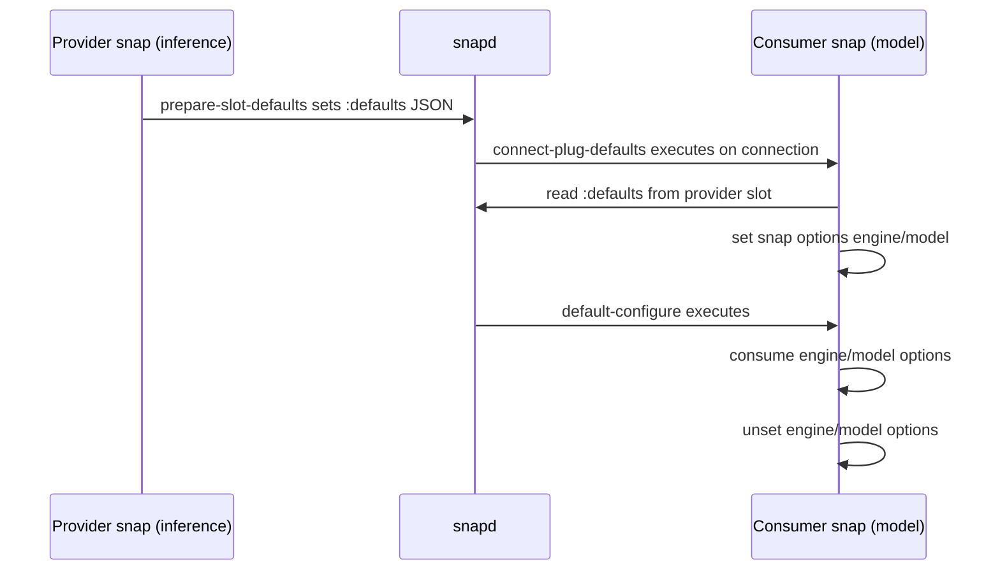

# Content Sharing Specification

## 1. Purpose

This document specifies how the `inference` snap shares install-time defaults with an inference model snap (for example `gemma3-jane`) using a content interface.

The goal is to provide model and engine defaults in a way that behaves like gadget-seeded defaults consumed by the `default-configure` hook.

## 2. Scope

This specification covers:

- The content interface contract between provider and consumer snaps.
- The attribute payload format used for defaults.
- Hook responsibilities and ordering.
- Required lifecycle behavior to apply defaults once and then discard them.

This specification does not define:

- Store policies or review requirements.
- Runtime inference API behavior.
- Non-default configuration management after initial installation.

## 3. Roles

- Provider snap: `inference`
  - Exposes slot `defaults` (interface: `content`, content label: `defaults`).
  - Writes defaults into slot attributes during `prepare-slot-defaults`.

- Consumer snap: model snap such as `gemma3-jane`
  - Exposes plug `defaults` (interface: `content`, content label: `defaults`).
  - Reads provider attributes in `connect-plug-defaults`.
  - Persists extracted values as snap options.
  - Applies options in `default-configure`.

## 4. Interface Contract

### 4.1 Provider Slot

Provider snap must declare:

- Slot name: `defaults`
- Interface: `content`
- Content identifier: `defaults`

Provider source path is implementation detail for this flow; attributes are the primary data channel.

### 4.2 Consumer Plug

Consumer snap must declare:

- Plug name: `defaults`
- Interface: `content`
- Content identifier: `defaults`
- A target path under `$SNAP_COMMON` for mount compatibility.

### 4.3 Connectivity Requirement

The plug and slot must be connected at install time so that consumer hooks can read slot attributes. The design assumes auto-connect is available when both snaps are published by the same publisher.

## 5. Data Model

Defaults are represented as JSON object data stored under the slot attribute key `:defaults`.

Provider payload shape:

```json
{
  "<consumer-id>": {
    "engine": "<engine-name>",
    "model": "<model-name>"
  }
}
```

Example payload:

```json
{
  "gemma3": {
    "engine": "intel-gpu",
    "model": "gemma3-270m"
  }
}
```

Consumer retrieves the subset for its identity from the slot, for example:

```bash
snapctl get :defaults --slot snap.gemma3
```

Expected consumer-side extracted fields:

- `engine` (string, required)
- `model` (string, required)

## 6. Hook Lifecycle and Responsibilities

### 6.1 Provider `prepare-slot-defaults`

Responsibilities:

- Construct JSON defaults map.
- Write map to slot attribute:

```bash
snapctl set :defaults -t snap='<json-object>'
```

Requirements:

- Payload must be valid JSON.
- Consumer key must match the consumer identity expected by connect hook lookup.

### 6.2 Consumer `connect-plug-defaults`

Responsibilities:

- Read defaults from provider slot attributes.
- Parse JSON and extract `engine` and `model`.
- Write values to consumer snap options.

Required behavior:

1. Read attribute data from connected slot.
2. Validate extracted values are present and non-empty.
3. Persist as snap options:
   - `snapctl set engine=<value>`
   - `snapctl set model=<value>`

### 6.3 Consumer `default-configure`

Responsibilities:

- Read snap options set by `connect-plug-defaults`.
- Apply one-time install-time configuration.
- Clear consumed options after successful application.

Required behavior:

1. `snapctl get engine`
2. `snapctl get model`
3. Apply configuration logic.
4. `snapctl unset engine`
5. `snapctl unset model`

### 6.4 Consumer `configure`

When `default-configure` exists, a `configure` hook must also exist. It may be a no-op.

## 7. Ordering and Control Flow

High-level sequence:



Normative expectation:

- `default-configure` must use values staged by `connect-plug-defaults`.
- Configuration values are one-shot defaults and must not persist after application.

## 8. Error Handling Requirements

Consumer connect hook must fail fast when:

- Slot attribute payload is missing.
- JSON payload is malformed.
- Required keys `engine` or `model` are missing.

Consumer default-configure must avoid partial state:

- If configuration application fails, keep diagnostic logs.
- Do not silently continue with empty defaults.

## 9. Logging Requirements

Hooks should log to both stdout and syslog using a deterministic tag format:

- `snap.<instance>.hook.prepare-slot-config`
- `snap.<instance>.hook.connect-plug-config`
- `snap.<instance>.hook.default-configure`
- `snap.<instance>.hook.configure`

Logs should include:

- Hook start message.
- Presence and values (or sanitized values) of extracted defaults.
- Success or failure outcome.

## 10. Security and Compatibility Notes

- Attribute-based transfer is preferred over file-based transfer for parity with gadget-like default consumption.
- The transport values are configuration defaults and should not contain secrets.
- Interface label `content: defaults` must match between provider and consumer.
- Behavior is designed around classic installs where install-time config injection is not directly available.

## 11. Validation Checklist

Provider:

- Slot `defaults` declared.
- `prepare-slot-defaults` writes valid JSON under `:defaults`.

Consumer:

- Plug `defaults` declared.
- `connect-plug-defaults` reads and sets `engine` and `model` options.
- `default-configure` consumes and unsets `engine` and `model`.
- `configure` hook exists.

Integration:

- Snaps connect successfully.
- Hook logs show expected order and values.
- `engine` and `model` are absent from snap options after successful default-configure.
