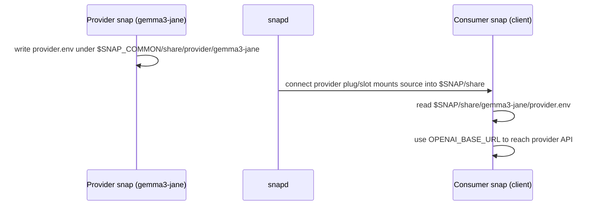

# Content Sharing Specification

## 1. Purpose

This document specifies how an inference snap (for example `gemma3-jane`) shares runtime provider details with client snaps (for example `consumer`) using a content interface.

The goal is to expose the information a client needs to reach the inference provider's API (such as the OpenAI-compatible base URL) as a file that clients can read after connecting.

## 2. Scope

This specification covers:

- The content interface contract between the inference (provider) snap and client (consumer) snaps.
- The file-based payload format used for provider details.
- Directory and path requirements for reliable content sharing.
- Runtime responsibilities for producing and consuming the payload.

This specification does not cover:

- Store policies or review requirements.
- The inference server's runtime API behavior or authentication scheme.
- Model weight sharing, which is currently not achievable via the content interface (see [Section 9](#9-model-weights-out-of-scope)).

## 3. Roles

- Provider snap: inference snap such as `gemma3-jane`
  - Exposes slot `provider` (interface: `content`, content identifier: `provider`).
  - Writes provider details into a file under its shared source directory at runtime.

- Consumer snap: client snap such as `consumer`
  - Exposes plug `provider` (interface: `content`, content identifier: `provider`).
  - Reads the shared file from its mounted target directory.

## 4. Interface Contract

### 4.1 Provider Slot

Provider snap must declare:

- Slot name: `provider`
- Interface: `content`
- Content identifier: `provider`
- A read source path under `$SNAP_COMMON` whose last path segment is unique to the provider snap, for example `$SNAP_COMMON/share/provider/gemma3-jane`.

```yaml
slots:
  provider:
    interface: content
    content: provider
    source:
      read:
        - $SNAP_COMMON/share/provider/gemma3-jane
```

### 4.2 Consumer Plug

Consumer snap must declare:

- Plug name: `provider`
- Interface: `content`
- Content identifier: `provider`
- A target path where the provider source is mounted, for example `$SNAP/share`.

```yaml
plugs:
  provider:
    interface: content
    content: provider
    target: $SNAP/share
```

### 4.3 Connectivity Requirement

The plug and slot must be connected for the consumer to read the shared file. Auto-connection is expected when both snaps are published by the same publisher; otherwise the connection is made manually:

```bash
sudo snap connect consumer:provider gemma3-jane:provider
```

## 5. Data Model

Provider details are stored in a single file named `provider.env` using shell-style `KEY=value` environment syntax.

Required content:

- `OPENAI_BASE_URL` — the base URL of the OpenAI-compatible inference API.

Example `provider.env`:

```bash
# <timestamp>
OPENAI_BASE_URL=http://localhost:8080/v1
```

Notes:

- The format is intentionally minimal and extensible. Additional keys (for example model identifiers or additional endpoints) may be added without breaking existing consumers.
- The payload is not versioned. The API itself is versioned via the URL, and the flat key/value format is expected to remain backward compatible.
- The payload must not be specialized to a single client. Consumers read the keys they understand and react accordingly.

## 6. Path and Mount Requirements

The provider source directory and the consumer target directory must satisfy the following constraints, which were validated in the PoC:

- The provider source read path must live under `$SNAP_COMMON` (for example `$SNAP_COMMON/share/provider/<provider-name>`).
- The last path segment of the source must be unique to the provider snap to avoid conflicts that cause snapd to create numbered mount directories.
- `$SNAP_INSTANCE_NAME` must not be used in the source path; unclean mount paths cause the mount namespace change to fail.
- A tmpfs location (for example under `/run` or `/tmp`) must not be used; the directory mounts but its contents do not propagate to the consumer.
- User-scoped directories (`$SNAP_USER_COMMON`, `$SNAP_USER_DATA`) must not be used; snapd does not support them for content sharing.

Because the source directory's last segment (`gemma3-jane`) is preserved under the consumer's target, the consumer reads the file at:

```
$SNAP/share/gemma3-jane/provider.env
```

## 7. Runtime Responsibilities

### 7.1 Provider

The provider produces the shared file at runtime (for example from its application startup):

1. Ensure the shared directory exists: `mkdir -p $SNAP_COMMON/share/provider/gemma3-jane`.
2. Write `provider.env` with the current provider details, including `OPENAI_BASE_URL`.

### 7.2 Consumer

The consumer reads the shared file from its mounted target:

1. Read `$SNAP/share/gemma3-jane/provider.env`.
2. Parse the `KEY=value` entries and use `OPENAI_BASE_URL` (and any additional recognized keys) to reach the provider API.

## 8. Ordering and Control Flow



Normative expectations:

- The consumer must tolerate the file being absent or empty until the provider has produced it.
- The consumer must not assume any key beyond `OPENAI_BASE_URL` is present.

## 9. Model Weights (Out of Scope)

Sharing model weights that are packaged as snap components is currently not achievable via the content interface. Attempted approaches and their failures:

- `$SNAP/components/$SNAP_REVISION/model-a` — rejected: content interface path is not clean.
- `/snap/<snap>/components/$SNAP_REVISION/model-a` — `$SNAP_REVISION` is not resolved in this context.
- `/snap/<snap>/components` — mounts empty on the consumer side.

A separate `model-weights` content interface is reserved for this purpose but is not functional under the current snapd behavior.

## 10. Security and Compatibility Notes

- The shared payload carries connection details for reaching the provider API. It should not contain secrets such as long-lived credentials.
- The content identifier `provider` must match between the provider slot and the consumer plug.
- The `provider.env` format is unversioned and must remain backward compatible; new keys are additive only.

## 11. Validation Checklist

Provider:

- Slot `provider` declared with content identifier `provider`.
- Source read path under `$SNAP_COMMON` with a unique last segment.
- `provider.env` written at runtime containing `OPENAI_BASE_URL`.

Consumer:

- Plug `provider` declared with content identifier `provider`.
- Target path (for example `$SNAP/share`) declared.
- Reads `$SNAP/share/<provider-name>/provider.env`.

Integration:

- Plug and slot connect successfully.
- The consumer reads the expected `OPENAI_BASE_URL` value from the mounted file.
